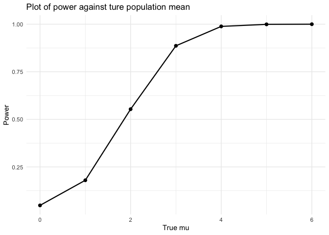
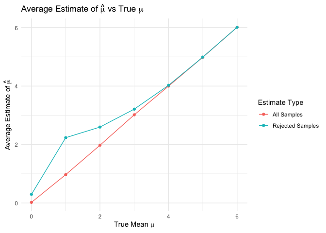

p8105_hw5_ts3670
================
Tong Su
2024-11-15

## Question 2

``` r
t_test = function(mu, n=30, sigma=5){
  
    x = rnorm(n, mean = mu, sd = sigma)
  
  t.test(x, mu = 0) |>
    broom::tidy() |>
    select(estimate, p.value)
}

t_test_sim = 
  expand_grid(
    mu_vec = c(0:6),
    iter = 1:5000
  ) |> 
  mutate(
    t_test_output = map(mu_vec, t_test)
  ) |> 
  unnest(t_test_output)

t_test_sim |> 
  pivot_longer(
    estimate:p.value,
    names_to = "parameter", 
    values_to = "estimate") |> 
  group_by(parameter, mu_vec) |> 
  summarize(
    emp_mean = mean(estimate),
    emp_var = var(estimate)) |> 
  knitr::kable(digits = 5)
```

    ## `summarise()` has grouped output by 'parameter'. You can override using the
    ## `.groups` argument.

| parameter | mu_vec | emp_mean | emp_var |
|:----------|-------:|---------:|--------:|
| estimate  |      0 |  0.02139 | 0.84778 |
| estimate  |      1 |  0.97082 | 0.84402 |
| estimate  |      2 |  1.97692 | 0.82981 |
| estimate  |      3 |  3.01745 | 0.86640 |
| estimate  |      4 |  3.99912 | 0.83705 |
| estimate  |      5 |  4.98858 | 0.83554 |
| estimate  |      6 |  6.01319 | 0.83444 |
| p.value   |      0 |  0.49880 | 0.08475 |
| p.value   |      1 |  0.35460 | 0.09029 |
| p.value   |      2 |  0.12260 | 0.03769 |
| p.value   |      3 |  0.02363 | 0.00490 |
| p.value   |      4 |  0.00313 | 0.00024 |
| p.value   |      5 |  0.00036 | 0.00002 |
| p.value   |      6 |  0.00003 | 0.00000 |

Plot the proportion of rejected nulls (power) on the y-axis and true μ
on the x-axis.

``` r
t_test_sim |>
  group_by(mu_vec) |>
  summarize(power = mean(p.value < 0.05))|>
  ggplot(aes(x = mu_vec, y = power)) +
  geom_line(size=0.8) +
  geom_point(size = 2) +
  labs(title = 'Plot of power against ture population mean',
       x = 'True mu',
       y = 'Power') +
  theme_minimal()
```

    ## Warning: Using `size` aesthetic for lines was deprecated in ggplot2 3.4.0.
    ## ℹ Please use `linewidth` instead.
    ## This warning is displayed once every 8 hours.
    ## Call `lifecycle::last_lifecycle_warnings()` to see where this warning was
    ## generated.

<!-- --> The
association between effect size and power is positive and nonlinearAs
the effect size (μ) increases, the power also increases. This is because
larger effect sizes lead to greater differences between the sample mean
and the null hypothesis value, making it easier to detect the true
effect and reject the null hypothesis.

Plot the average μ^ on the y-axis and true μ on the x-axis.

``` r
average_mu_df = t_test_sim |>
  group_by(mu_vec) |>
  summarise(
    avg_mu = mean(estimate)
  )

average_mu_rejected_df = t_test_sim |>
  filter(p.value < 0.05) |>
  group_by(mu_vec) |>
  summarise(
    avg_mu_rejected = mean(estimate)
  )

combined_estimate_df = left_join(average_mu_df, average_mu_rejected_df, by = "mu_vec") |> 
  pivot_longer(
    cols = c(avg_mu, avg_mu_rejected),
    names_to = "estimate_type",
    values_to = "average_mu"
  )

combined_estimate_df$estimate_type = recode(
  combined_estimate_df$estimate_type,
  "avg_mu" = "All Samples",
  "avg_mu_rejected" = "Rejected Samples"
)

# Plot the average estimates
ggplot(combined_estimate_df, aes(x = mu_vec, y = average_mu, color = estimate_type)) +
  geom_line() +
  geom_point() +
  labs(
    title = expression('Average Estimate of ' * hat(mu) * ' vs True ' * mu),
    x = expression('True Mean ' * mu),
    y = expression('Average Estimate of ' * hat(mu)),
    color = "Estimate Type"
  ) +
  theme_minimal()
```

<!-- --> The
sample average of $\hat{\mu}$” for rejected tests tends to overestimate
the true value of $\mu$, especially when the power of the test is
moderate or low. Tests that reject the null hypothesis tend to come from
datasets where the sample mean $\hat{\mu}$ deviates significantly from
the null value. These deviations are often larger than the true mean,
creating an upward bias in the average of $\hat{\mu}$“for rejected
tests.

## Question 3

``` r
homicide_df = read.csv("./data/homicide-data.csv")|>
  janitor::clean_names()
```

The dataset comprises 12 variables and 52,179 observations, detailing
homicide cases across various states. Each row represents a unique case,
identified by a UID. Key columns include the report date, the victim’s
first and last names, race, age, and sex, the city and state of the
incident, geographic coordinates (latitude and longitude) of the
incident and the case disposition status. The case disposition status
includes “Closed by arrest”, “Closed without arrest”, or “Open/No
arrest”.

``` r
homicide_df=homicide_df|>
  mutate(state = ifelse(city == "Seattle", "WA", state),
         city_state = paste(city, state, sep=", "))

homicides = homicide_df|>
  group_by (city_state) |>
  summarise (homicides = n())

unsolved = homicide_df |>
  group_by(city_state) |>
  filter(disposition %in% c("Open/No arrest", "Closed without arrest")) |>
  summarise(unsolved = n())

city_state_counts_df = homicides |> left_join (unsolved)
```

    ## Joining with `by = join_by(city_state)`

``` r
baltimore_df= city_state_counts_df|>
  filter(city_state == "Baltimore, MD")

prop.test(n = pull (baltimore_df, homicides),
           x = pull(baltimore_df, unsolved)) |>
  broom:: tidy() |>
  select (estimate, conf.low, conf.high)
```

    ## # A tibble: 1 × 3
    ##   estimate conf.low conf.high
    ##      <dbl>    <dbl>     <dbl>
    ## 1    0.646    0.628     0.663

``` r
city_proportion_test = city_state_counts_df |>
  filter (homicides > 0 & unsolved >= 0) |>
  mutate(test_result = purrr::map2(unsolved, homicides, ~ prop.test(.x,.y)))|>
  mutate(test_result = purrr::map(test_result, broom::tidy)) |>
  unnest(test_result)|>
  select (city_state, estimate, conf.low, conf.high)

city_proportion_test
```

    ## # A tibble: 50 × 4
    ##    city_state      estimate conf.low conf.high
    ##    <chr>              <dbl>    <dbl>     <dbl>
    ##  1 Albuquerque, NM    0.386    0.337     0.438
    ##  2 Atlanta, GA        0.383    0.353     0.415
    ##  3 Baltimore, MD      0.646    0.628     0.663
    ##  4 Baton Rouge, LA    0.462    0.414     0.511
    ##  5 Birmingham, AL     0.434    0.399     0.469
    ##  6 Boston, MA         0.505    0.465     0.545
    ##  7 Buffalo, NY        0.612    0.569     0.654
    ##  8 Charlotte, NC      0.300    0.266     0.336
    ##  9 Chicago, IL        0.736    0.724     0.747
    ## 10 Cincinnati, OH     0.445    0.408     0.483
    ## # ℹ 40 more rows

``` r
city_proportion_test |>
  arrange (desc(estimate)) |>
  mutate(city_state = factor (city_state, levels = city_state))|>
  ggplot (aes(x=city_state, y=estimate)) +
  geom_point (size = 0.8) +
  geom_errorbar(aes (ymin = conf.low, ymax = conf.high), width = 0.3) +
  labs (x="Cities", y="Proportion of Unsolved Homicides") +
  theme_minimal()+
  theme(axis.text.x = element_text(angle = 45, hjust = 1,size = 4))
```

<!-- -->
